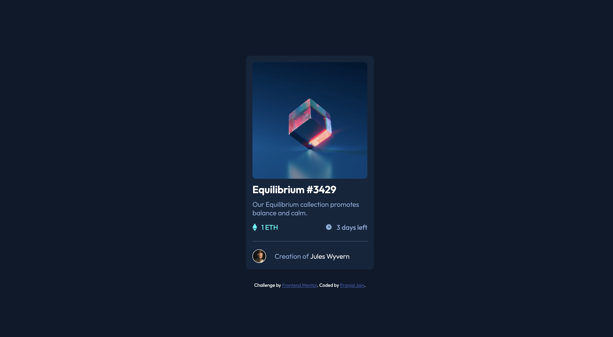

# Frontend Mentor - NFT preview card component solution

This is a solution to the [NFT preview card component challenge on Frontend Mentor](https://www.frontendmentor.io/challenges/nft-preview-card-component-SbdUL_w0U). Frontend Mentor challenges help you improve your coding skills by building realistic projects.

## Table of contents

- [Overview](#overview)
  - [The challenge](#the-challenge)
  - [Screenshot](#screenshot)
  - [Links](#links)
- [My process](#my-process)
  - [Built with](#built-with)
  - [Useful resources](#useful-resources)
- [Author](#author)

## Overview

This is a challenge in which I have to create a frontend of a card for an NFT item listing. For this challenge I went forward with basic HTML & CSS.

### The challenge

Users should be able to:

- View the optimal layout depending on their device's screen size
- See hover states for interactive elements

### Screenshot

### Links

- Solution URL: [nftcard-pranjaljain.vercel.app](https://nftcard-pranjaljain.vercel.app/)

## My process

Initially I started with the body where I created a card class and then I gave the height and width to the body to cover the whole page. then I started with the main card. Where i gave the card a fixed size of `300px` which was an estimate from the provided challenge image. then I added all the images and icons so that I can add the arrangement and flexbox wherever its required. Then I added multiple `div` which were there to divide the card content into multiple parts. After that I went to add margin and padding to elements so that the card start to form, Also I added `border-radius` properties to image and card which gave it more similar look to the challenge. as the initial look was finalized. Then I moved to giving interactions(Hover events) to the multiple elements. finally to add the last touch I added the shadow which I generated using [Smooth Shadows](https://shadows.brumm.af/).

### Built with

- HTML5
- CSS custom properties
- Flexbox

### Useful resources

- [Smooth Shadows](https://shadows.brumm.af/) - This helped me to generate smooth shadows

## Author

- Website - [Pranjal Jain](https://www.pranjaljain.me)
- Frontend Mentor - [@pranjaljain0](https://www.frontendmentor.io/profile/pranjaljain0)
- Twitter - [@pranjaljain0](https://www.twitter.com/pranjaljain0)
